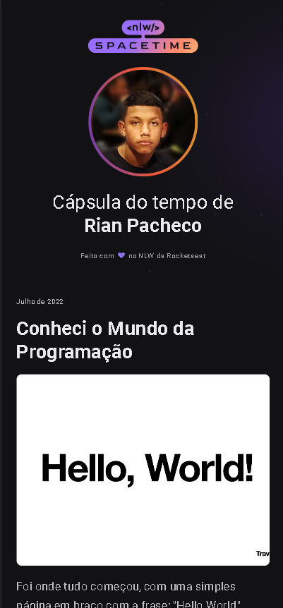

# NLW-SPACETIME &copy; Rian Pacheco 🚀

### link do projeto - https://rianpacheco.github.io/nlw-spacetime

 Projeto feito 100% para didática e colocar em pratica as tecnologias em front-end.

 Projeto feito durante o evento nlw-spacetime, trilha explorer da @rocketseat
 
 
Caso tenham interesse aos desafios acessem o <a href="https://www.figma.com/community/file/1240071097028170811">figma</a> 

## Preview Desktop

## Preview Mobile

# Tecnologias utilizadas

## Front end
- HTML
- CSS
- Figma 

## Implantação em produção
- GITHUB
- GIT

# Autor

&copy; <a href="https://www.linkedin.com/in/rian-pacheco/"> Rian Pacheco</a>

